  

<table>
  <tr>
    <td valign="centre"></td>
    <td valign="top"></td>
  </tr>
</table>

<!-- HERO SECTION -->

  <h3><strong>AI & Computer Vision Engineer</strong></h3>
  
<i>Building real-time computer vision systems, multimodal AI workflows, and agentic solutions.</i>

  

    
    
    
    
  

  
  

 

<!-- ABOUT SECTION -->
<h2 align="center">🚀 About Me</h2>

<table width="100%" border="0">
<tr>
<td width="60%" valign="top" style="border: none; background: none;">

### 👩‍💻 Who am I?

* 🎓 **B.Tech in Computer Engineering**
* 🤖 **AI & Computer Vision Engineer** passionate about building real-time vision systems, intelligent agents, and multimodal AI platforms.
* 📜 Certified in **Generative AI & Agentic AI with Python** from Naresh i Technologies.
* 💼 Completed **Data Science Internship** at 1Stop and **Remote Internship** at Apna College.
* 🌱 Currently exploring **Agentic Workflows, LangChain, RAG Systems, Advanced Pose Estimation, and YOLO Edge Deployments.**

<blockquote>
  

    <i>"Transforming visual data and foundational models into real-time, intelligent solutions."</i>
  

</blockquote>

</td>

<td width="40%" align="center" valign="middle" style="border: none; background: none;">

</td>
</tr>
</table>

---

<!-- COMPETITIVE PROGRAMMING & PROBLEM SOLVING -->

  

  

<table align="center" width="100%" border="0">
  <tr>
    <td align="center" width="50%" style="border: none; background: none;">
      
    </td>
    <td align="center" width="50%" style="border: none; background: none;">
      
    </td>
  </tr>
</table>

  

---

<!-- SKILLS SHOWCASE -->
<h2>⚡ Tech Stack & Engineering Arsenal</h2>

<table width="100%" align="center">
  <tr>
    <td width="50%" valign="top">
      <h3>💻 Core Programming</h3>
      
        
      <h3>👁️ Computer Vision & ML</h3>
      

        
        
        
         YOLOv5 • MediaPipe (33 Body Landmarks) • Haar Cascade Classifiers • Object Detection & Tracking • Pose Estimation
      

       
      <h3>🤖 Generative & Agentic AI</h3>
      

        
        
         Retrieval-Augmented Generation (RAG) • Groq API • Llama 3 • DeepSeek • Sentence-BERT • FAISS Vector Search • Agentic AI Workflows
      

    </td>
    <td width="50%" valign="top">
      <h3>⚙️ API Development & Deployment</h3>
      
      
Streamlit • WebSockets • Real-Time Image Streaming • REST APIs

       
      <h3>📊 Data Science & NLP</h3>
      
NLTK • TF-IDF Vectorization • Naive Bayes • K-Means Clustering • Hierarchical Clustering • Data Preprocessing & Analytics

       
      <h3>🛠️ Tools & Environments</h3>
      
    </td>
  </tr>
</table>

<!-- PROJECTS -->
<h2>💼 Featured Projects</h2>

<table width="100%">
  <tr>
    <td width="50%" valign="top">
      <h3>🧘 <a href="#">Real-Time Posture Monitoring System</a></h3>
      
A computer vision and deep learning application detecting 33 body landmarks in live webcam feeds to provide instant feedback on posture and exercise execution.

      

        <code>YOLOv5</code> <code>MediaPipe</code> <code>FastAPI</code> <code>React</code> <code>MongoDB</code>
      

      <ul>
        <li>✔ Real-time 33-landmark pose extraction</li>
        <li>✔ Instant visual and posture corrective feedback</li>
      </ul>
    </td>
    <td width="50%" valign="top">
      <h3>🪖 <a href="#">Helmet Compliance Detection System</a></h3>
      
A full-stack, real-time safety helmet detection application streaming live video via WebSockets for workplace safety compliance.

      

        <code>YOLO</code> <code>FastAPI</code> <code>WebSockets</code> <code>React</code> <code>OpenCV</code>
      

      <ul>
        <li>✔ Low-latency WebSocket video streaming</li>
        <li>✔ Automated safety violation alerts</li>
      </ul>
    </td>
  </tr>
  <tr>
    <td width="50%" valign="top">
      <h3>💬 <a href="#">RAG Customer Support Chatbot</a></h3>
      
An intelligent customer service architecture using semantic search, intent classification, and vector indexing with a dedicated administrative dashboard.

      

        <code>Sentence-BERT</code> <code>FAISS</code> <code>FastAPI</code> <code>LangChain</code>
      

      <ul>
        <li>✔ High-accuracy vector retrieval using FAISS</li>
        <li>✔ Scalable intent classification pipeline</li>
      </ul>
    </td>
    <td width="50%" valign="top">
      <h3>📜 <a href="#">Manuscript Region Detection</a></h3>
      
A specialized computer vision backend designed to parse and segment layout regions in ancient and historical manuscript documents.

      

        <code>Python</code> <code>OpenCV</code> <code>FastAPI</code> <code>PyTorch</code>
      

      <ul>
        <li>✔ Precision document layout segmentation</li>
        <li>✔ API endpoints for image extraction</li>
      </ul>
    </td>
  </tr>
</table>

<!-- ENGINEERING EXPERIENCE -->
<h2>🚀 Core Competencies & Capabilities</h2>

<table width="100%">
  <tr>
    <td width="33%" valign="top">
      <h3>👁️ Computer Vision</h3>
      <ul>
        <li>Object Detection (YOLOv5)</li>
        <li>Pose Estimation (MediaPipe)</li>
        <li>Haar Cascade Detection</li>
        <li>Real-Time Video Analytics</li>
        <li>Frame Processing & Streaming</li>
        <li>OpenCV Pipeline Optimization</li>
      </ul>
    </td>
    <td width="33%" valign="top">
      <h3>🤖 AI & Generative Workflows</h3>
      <ul>
        <li>RAG System Design</li>
        <li>Vector Search (FAISS)</li>
        <li>LangChain Integration</li>
        <li>Groq & Gemini API Scaling</li>
        <li>Intent Classification</li>
        <li>Sentence Embeddings</li>
      </ul>
    </td>
    <td width="34%" valign="top">
      <h3>🌐 Model Serving & Web APIs</h3>
      <ul>
        <li>FastAPI Endpoint Architecture</li>
        <li>WebSocket Streaming</li>
        <li>Streamlit Interfaces</li>
        <li>React & Modern UI Integration</li>
        <li>MongoDB Data Models</li>
        <li>RESTful API Design</li>
      </ul>
    </td>
  </tr>
  <tr>
    <td width="33%" valign="top">
      <h3>📊 Data Science & ML</h3>
      <ul>
        <li>Scikit-learn Algorithms</li>
        <li>K-Means & Hierarchical Clustering</li>
        <li>Customer Segmentation Analytics</li>
        <li>TF-IDF & Text Processing</li>
        <li>NLTK Spam Classification</li>
      </ul>
    </td>
    <td width="33%" valign="top">
      <h3>💻 Software Development</h3>
      <ul>
        <li>Modular Python Engineering</li>
        <li>Algorithmic Optimization</li>
        <li>Git Version Control</li>
        <li>Interactive Portfolio Engineering</li>
      </ul>
    </td>
    <td width="34%" valign="top">
      <h3>💡 Problem Solving</h3>
      <ul>
        <li>Data Structures & Algorithms</li>
        <li>LeetCode Problem Solving</li>
        <li>Real-time Latency Reduction</li>
      </ul>
    </td>
  </tr>
</table>

<!-- GITHUB STATS -->
<h2>📈 GitHub Analytics & Activity</h2>

  
  

  

    
  

  

    
  

